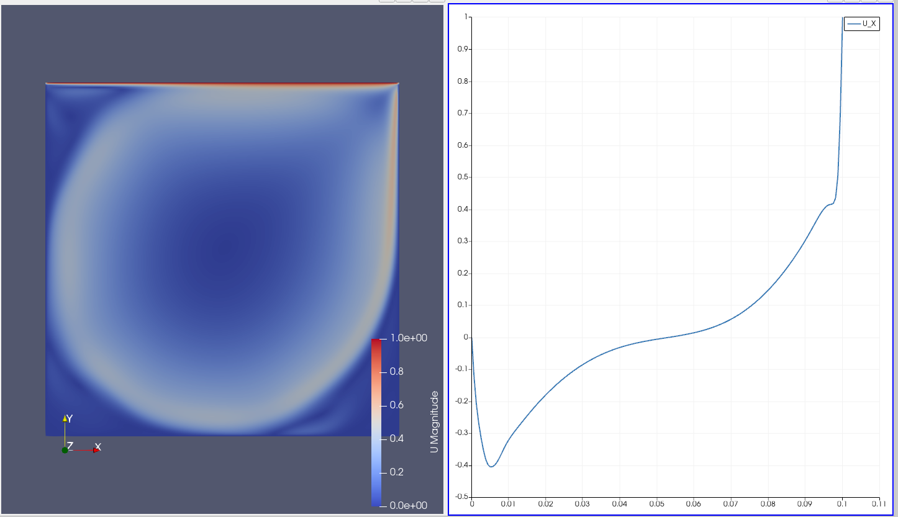
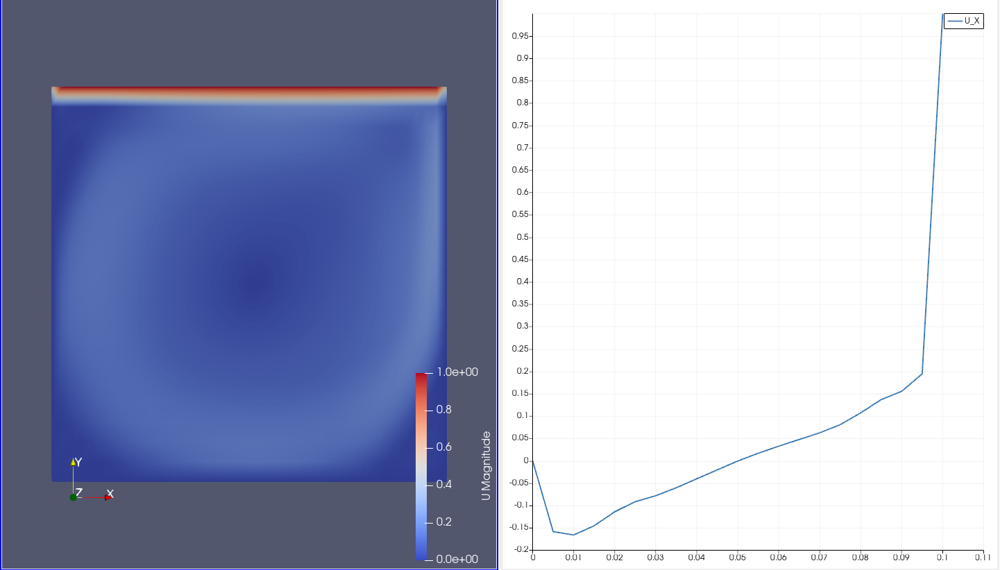
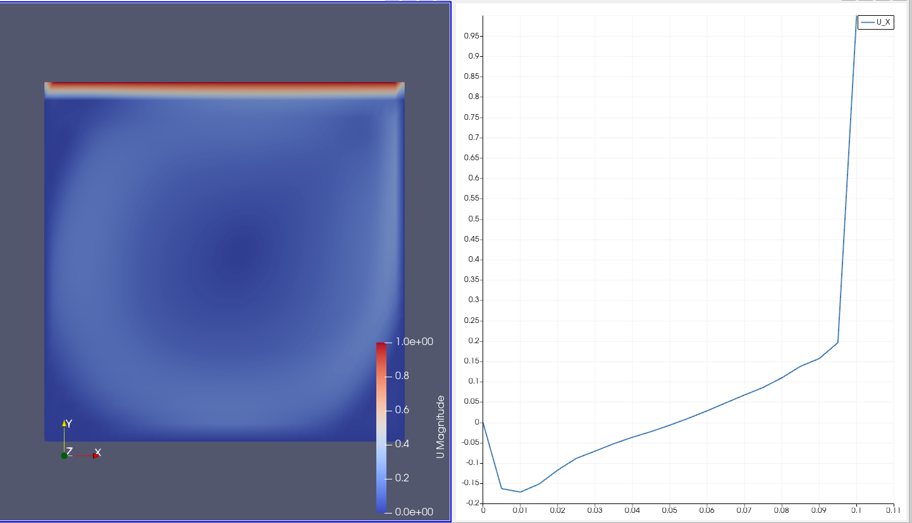
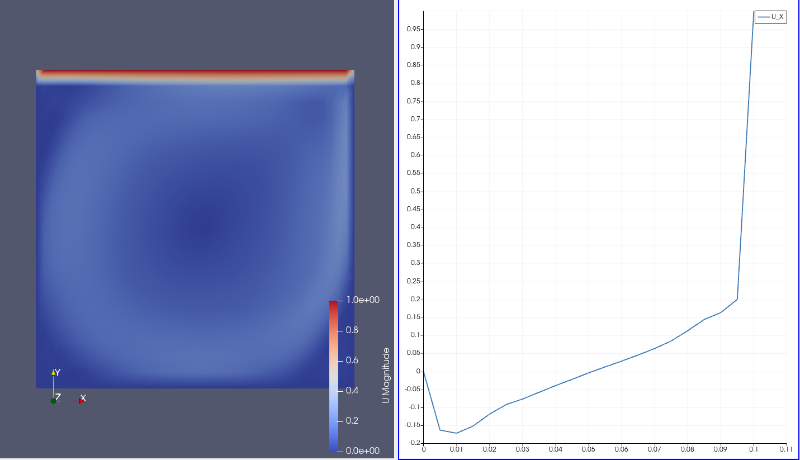
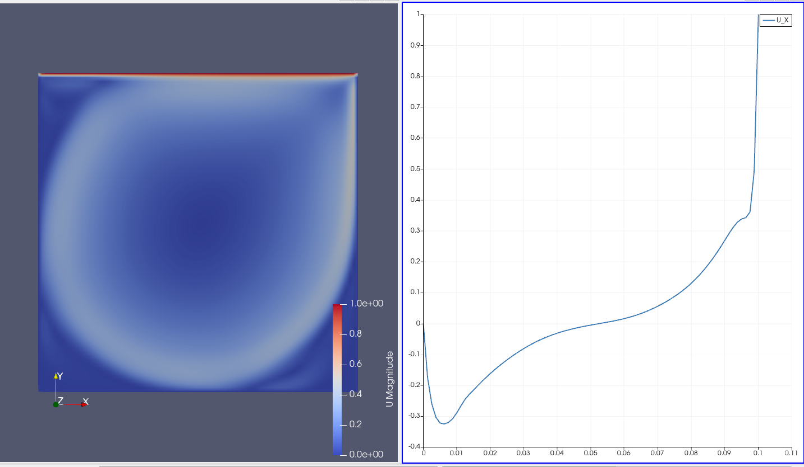
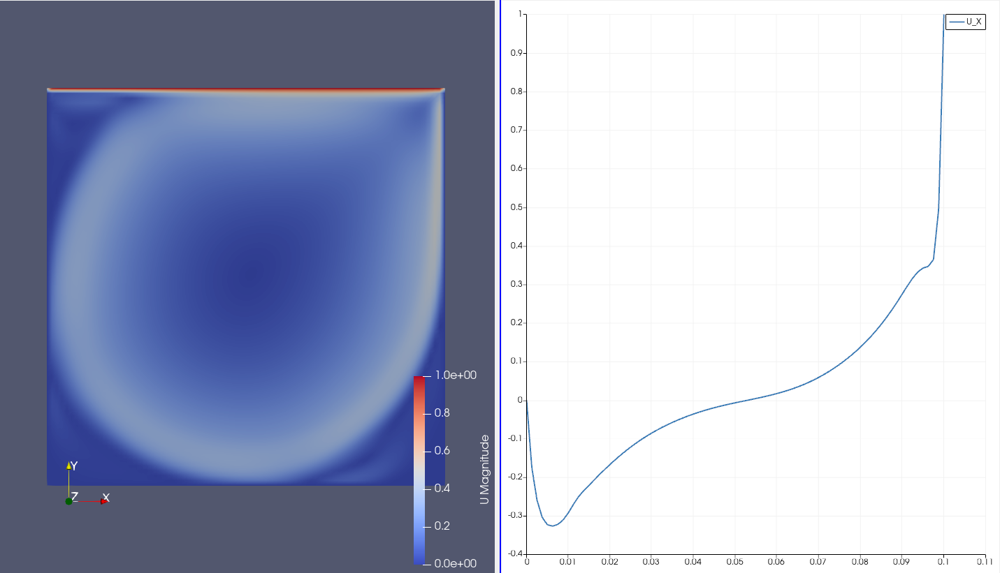
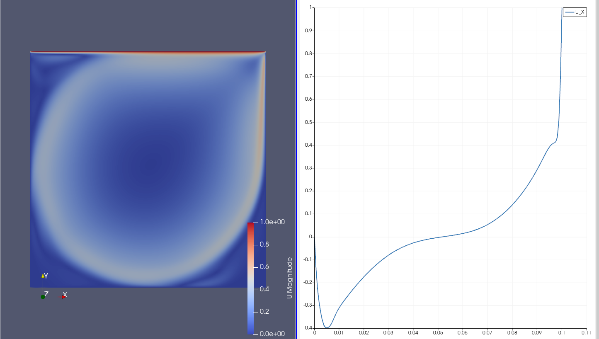
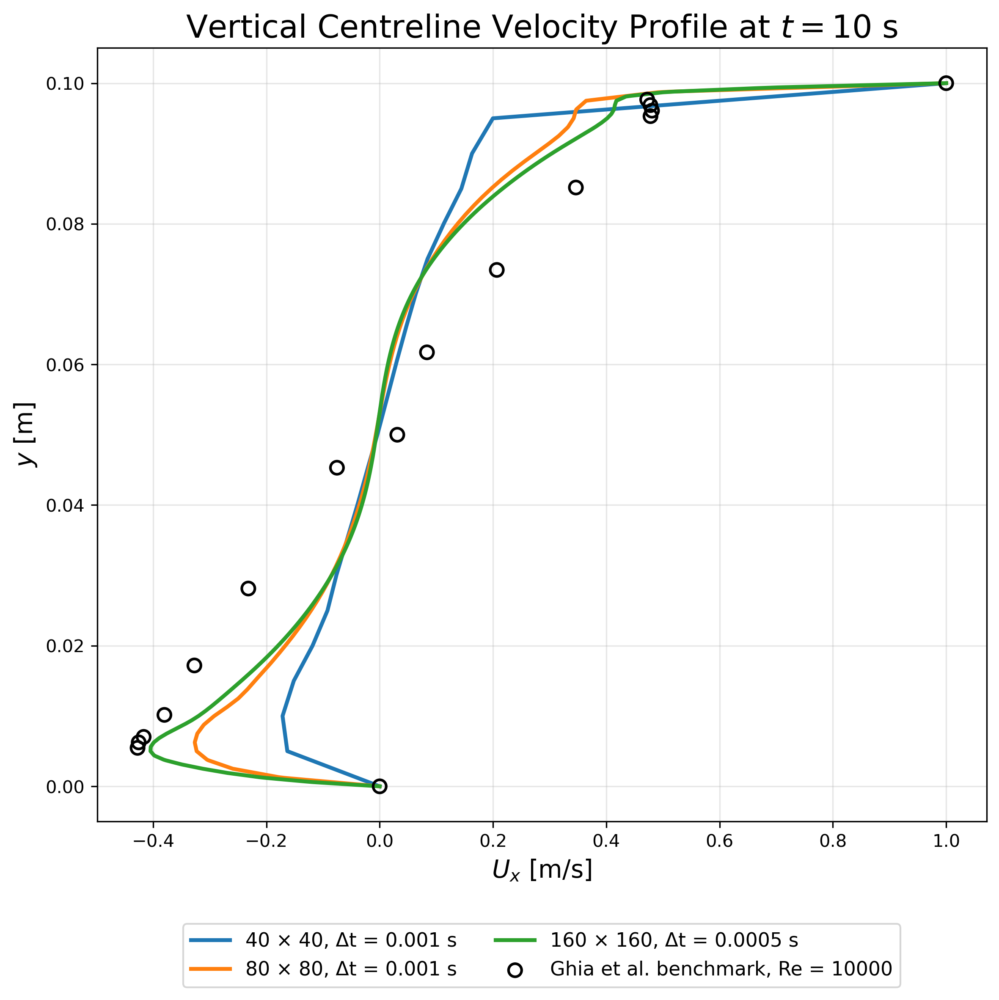

<div align="center">

# 🌀 Lid-Driven Cavity Mesh Sensitivity Study

### OpenFOAM 13 · 2D Transient Laminar Flow · ParaView Post-Processing

A numerical mesh and time-step sensitivity investigation of a two-dimensional lid-driven cavity flow.

<br>


<br>



<br>

**Mesh resolutions:** 40 × 40 · 80 × 80 · 160 × 160

</div>

---

## 📌 Project Overview

This repository presents a mesh and time-step sensitivity study of a two-dimensional lid-driven cavity flow using **OpenFOAM 13**.

The flow is generated by a horizontal upper wall moving at a constant velocity while the remaining cavity walls remain stationary.

Three structured Cartesian meshes are investigated:

| Case | Mesh resolution | Cell count | Time-step |
|---|---:|---:|---:|
| `cavity_mesh40` | 40 × 40 × 1 | 1,600 | 0.001 s |
| `cavity_mesh80` | 80 × 80 × 1 | 6,400 | 0.001 s |
| `cavity_mesh160` | 160 × 160 × 1 | 25,600 | 0.0005 s |

The results are evaluated using:

- Velocity-magnitude contours
- Vertical centreline \(U_x\) profiles
- Temporal comparisons at \(t=8\), \(9\), and \(10\) s
- Reverse-flow velocity magnitude
- Near-wall velocity-gradient resolution

> [!IMPORTANT]
> The 160 × 160 case uses a smaller time-step because the simulation became numerically unstable with \(\Delta t=0.001\) s.
>
> Therefore, this project represents a **combined mesh and time-step sensitivity study**, rather than a strictly controlled grid-independence assessment.

---

## ⚙️ Physical Configuration

The computational domain is a square cavity.

| Parameter | Value |
|---|---:|
| Cavity length, \(L_x\) | 0.1 m |
| Cavity height, \(L_y\) | 0.1 m |
| Numerical thickness, \(L_z\) | 0.01 m |
| Lid velocity, \(U_{\text{lid}}\) | 1 m/s |
| Kinematic viscosity, \(\nu\) | \(1\times10^{-5}\) m²/s |
| Reynolds number | 10,000 |
| End time | 10 s |

The Reynolds number is calculated as:

\[
Re=\frac{U_{\text{lid}}L}{\nu}
\]

\[
Re=\frac{(1)(0.1)}{1\times10^{-5}}=10,000
\]

The flow is modelled as:

- Incompressible
- Laminar
- Transient
- Two-dimensional

---

## 🧱 Boundary Conditions

### Velocity

The upper wall moves in the positive \(x\)-direction:

```text
U = (1 0 0) m/s
```

The remaining solid walls are stationary:

```text
U = (0 0 0) m/s
```

The front and back patches use:

```text
empty
```

This represents a two-dimensional flow model.

### Pressure

The solid walls use zero-normal-gradient pressure boundary conditions.

The front and back patches are defined as:

```text
empty
```

---

## 🖥️ Software and Tools

| Tool | Purpose |
|---|---|
| OpenFOAM 13 | CFD solution |
| `incompressibleFluid` | Incompressible-flow solver module |
| `blockMesh` | Structured mesh generation |
| ParaView | Visualization and post-processing |
| Ubuntu 24.04 | Operating system |
| WSL2 | Linux environment on Windows |

---

## 📁 Repository Structure

```text
.
├── cavity_mesh40
│   ├── 0
│   │   ├── U
│   │   └── p
│   ├── constant
│   │   ├── momentumTransport
│   │   └── physicalProperties
│   └── system
│       ├── blockMeshDict
│       ├── controlDict
│       ├── fvSchemes
│       └── fvSolution
│
├── cavity_mesh80
│   ├── 0
│   ├── constant
│   └── system
│
├── cavity_mesh160
│   ├── 0
│   ├── constant
│   └── system
│
├── images
│   ├── mesh40_t8.png
│   ├── mesh40_t9.png
│   ├── mesh40_t10.png
│   ├── mesh80_t8.png
│   ├── mesh80_t9.png
│   ├── mesh80_t10.png
│   ├── mesh160_t8.png
│   ├── mesh160_t9.png
│   └── mesh160_t10.png
│
├── .gitignore
├── LICENSE
└── README.md
```

Generated files are excluded from version control, including:

- Solution time directories
- Generated `polyMesh` directories
- Parallel processor directories
- ParaView marker files
- Post-processing outputs
- Log files
- Core dumps

---

## 📐 Mesh and Time-Step Configuration

| Case | Mesh | Number of cells | Time-step |
|---|---:|---:|---:|
| `cavity_mesh40` | 40 × 40 × 1 | 1,600 | 0.001 s |
| `cavity_mesh80` | 80 × 80 × 1 | 6,400 | 0.001 s |
| `cavity_mesh160` | 160 × 160 × 1 | 25,600 | 0.0005 s |

The 160 × 160 case required a smaller time-step for numerical stability.

Therefore, part of the difference between the 80 × 80 and 160 × 160 solutions may be associated with temporal refinement as well as spatial refinement.

---

## 📊 Post-Processing Method

The primary comparison quantity is the \(x\)-component of velocity along the vertical cavity centreline.

The sampling line used in ParaView is:

```text
Point1 = (0.05 0.00 0.005)
Point2 = (0.05 0.10 0.005)
```

Therefore:

\[
x=0.05\ \text{m}
\]

\[
0\leq y\leq0.10\ \text{m}
\]

The displayed images contain:

- Velocity-magnitude contours
- Vertical centreline \(U_x\) profiles
- Results at \(t=8\), \(9\), and \(10\) s

---

# 📈 Simulation Results

## 🔹 40 × 40 Mesh

The coarsest mesh produces a relatively smooth and diffusive velocity field.

The reverse-flow region is considerably weaker than in the finer-mesh solutions.

### \(t=8\) s

<div align="center">



</div>

### \(t=9\) s

<div align="center">



</div>

### \(t=10\) s

<div align="center">



</div>

### Observations

- The profiles at \(t=8\), \(9\), and \(10\) s are nearly identical.
- The solution is approximately time-invariant over the investigated interval.
- The minimum centreline \(U_x\) is approximately \(-0.17\) m/s.
- Near-wall gradients are comparatively smooth.
- The reverse-flow velocity is underpredicted relative to the finer meshes.

---

## 🔸 80 × 80 Mesh

The 80 × 80 mesh produces stronger recirculation and sharper near-wall velocity gradients.

### \(t=8\) s

<div align="center">


</div>

### \(t=9\) s

<div align="center">



</div>

### \(t=10\) s

<div align="center">



</div>

### Observations

- The profiles show little variation between \(t=8\) and \(10\) s.
- The reverse-flow region is significantly stronger than in the 40 × 40 solution.
- The minimum centreline \(U_x\) is approximately \(-0.33\) m/s.
- Near-wall velocity gradients are resolved more sharply.
- The main recirculation structure is represented more clearly.

---

## 🔺 160 × 160 Mesh

The finest mesh provides the strongest reverse-flow prediction and the sharpest resolved gradients.

A time-step of \(0.0005\) s was used for numerical stability.

### \(t=8\) s

<div align="center">


</div>

### \(t=9\) s

<div align="center">



</div>

### \(t=10\) s

<div align="center">


</div>

### Observations

- The profiles at \(t=8\), \(9\), and \(10\) s are very close.
- The solution is approximately time-invariant within this interval.
- The minimum centreline \(U_x\) is approximately \(-0.40\) m/s.
- The reverse-flow region is stronger than in both coarser cases.
- Near-wall velocity gradients are resolved more sharply.
- The zero-crossing location remains close to the middle of the cavity.

---

## 📉 Mesh Sensitivity and Validation Comparison

The vertical centreline velocity profiles were compared for the three investigated mesh resolutions and against the benchmark data of Ghia et al. at \(Re = 10{,}000\).

<div align="center">



</div>

The minimum vertical-centreline \(U_x\) values obtained from the exported CSV data are:

| Mesh | Minimum \(U_x\) | Location |
|---|---:|---:|
| 40 × 40 | \(-0.171446\) m/s | \(y = 0.0100\) m |
| 80 × 80 | \(-0.326312\) m/s | \(y = 0.0062\) m |
| 160 × 160 | \(-0.404567\) m/s | \(y = 0.0050\) m |
| Ghia et al. benchmark | approximately \(-0.42735\) | \(y/L \approx 0.0547\) |

The changes in minimum reverse-flow velocity between successive mesh levels are:

| Refinement | Change in minimum \(U_x\) magnitude |
|---|---:|
| 40 × 40 → 80 × 80 | 0.154866 m/s |
| 80 × 80 → 160 × 160 | 0.078255 m/s |

The change between the 80 × 80 and 160 × 160 solutions is smaller than the change between the 40 × 40 and 80 × 80 solutions.

This indicates a clear convergence trend with mesh refinement.

The 40 × 40 mesh produces a substantially different centreline profile, especially in the lower reverse-flow region and near the moving lid. The 80 × 80 and 160 × 160 solutions reproduce the overall benchmark trend more closely.

Among the investigated cases, the 160 × 160 mesh gives the closest agreement with the Ghia et al. benchmark in the lower recirculation region.

However, visible deviations remain in the central and upper portions of the cavity. Strict grid independence and full validation have therefore not yet been demonstrated.

> [!NOTE]
> The 160 × 160 case was simulated using \(\Delta t = 0.0005\) s, while the 40 × 40 and 80 × 80 cases used \(\Delta t = 0.001\) s.
>
> The present comparison therefore includes both spatial and temporal refinement effects.

---


## ⏱️ Temporal Behaviour

For each individual mesh, the velocity profiles at:

```text
t = 8 s
t = 9 s
t = 10 s
```

remain nearly unchanged.

This indicates that each solution has become approximately time-invariant over the selected interval.

The large differences between the mesh resolutions are therefore unlikely to be caused only by different transient phases.

A complete temporal-convergence study would still require each mesh to be simulated with multiple time-step values.

---

## 🧪 Running the Cases

Load the OpenFOAM environment:

```bash
source /opt/openfoam13/etc/bashrc
```

Enter one of the case directories:

```bash
cd cavity_mesh40
```

Generate the mesh:

```bash
blockMesh
```

Check mesh quality:

```bash
checkMesh
```

Run the solver:

```bash
foamRun
```

Open the results in ParaView:

```bash
paraFoam
```

The same workflow applies to:

```text
cavity_mesh80
cavity_mesh160
```

---

## 🔍 Time-Step Settings

### 40 × 40

```text
deltaT  0.001;
```

### 80 × 80

```text
deltaT  0.001;
```

### 160 × 160

```text
deltaT  0.0005;
```

The smaller time-step used for the 160 × 160 case was necessary to avoid numerical divergence and a floating-point exception during the momentum solution.

---

## ✅ Main Conclusions

1. The 40 × 40 mesh is too coarse to resolve the recirculating flow structure adequately.

2. Mesh refinement produces stronger reverse flow and sharper near-wall velocity gradients.

3. The 80 × 80 and 160 × 160 solutions are closer to each other than either is to the 40 × 40 solution.

4. The decreasing change between successive mesh levels indicates a spatial convergence trend.

5. The vertical centreline profiles are approximately time-invariant between \(t=8\) s and \(t=10\) s for each individual mesh.

6. The 160 × 160 solution provides the closest agreement with the Ghia et al. benchmark among the three investigated cases.

7. The finest mesh predicts a minimum centreline velocity of \(-0.404567\) m/s, compared with the benchmark value of approximately \(-0.42735\).

8. Visible differences remain between the 80 × 80 and 160 × 160 solutions, so strict grid independence has not yet been demonstrated.

9. Deviations from the benchmark remain in the central and upper portions of the cavity, so the solution should not yet be considered fully validated.

10. Since the 160 × 160 case uses a smaller time-step, the project is more accurately described as a combined mesh, time-step, and benchmark sensitivity study.

---

## ⚠️ Limitations

- The finest mesh uses a different time-step from the two coarser cases.
- Spatial and temporal discretization effects are therefore not fully isolated.
- A formal Grid Convergence Index calculation has not been performed.
- The benchmark comparison is currently limited to the vertical centreline \(U_x\) profile.
- Quantitative validation metrics such as RMSE, mean absolute error, and maximum absolute error have not yet been calculated.
- The horizontal centreline \(U_y\) profile has not yet been evaluated.
- Primary-vortex centre coordinates have not yet been calculated.
- Corner-vortex locations and strengths have not yet been quantified.
- Wall shear stress has not yet been evaluated.
- The influence of alternative temporal and spatial discretization schemes has not yet been investigated.
- The laminar modelling assumption at \(Re=10{,}000\) should be interpreted carefully.
- The present results indicate improving agreement with refinement, but they do not establish complete numerical validation.

---

## 🚀 Future Work

Potential extensions of the project include:

- Calculating RMSE, mean absolute error, and maximum absolute error relative to the Ghia et al. benchmark
- Comparing the horizontal centreline \(U_y\) profile with benchmark data
- Performing a formal Grid Convergence Index study
- Running all mesh levels with equivalent Courant-number control
- Conducting an independent time-step sensitivity study
- Repeating the 160 × 160 case using additional smaller time-step values
- Evaluating higher-order temporal discretization schemes
- Investigating alternative convection schemes
- Calculating the primary-vortex centre coordinates
- Quantifying secondary and corner vortices
- Computing wall shear stress distributions
- Comparing velocity contours with published benchmark solutions
- Assessing turbulence or transition modelling approaches for high-Reynolds-number cavity flow

## 📜 License

This project is licensed under the **MIT License**.

See the [`LICENSE`](LICENSE) file for details.

---

<div align="center">

### Developed as an OpenFOAM CFD learning and verification project

🌀 **OpenFOAM 13** · 🧱 **Structured Meshes** · 📊 **ParaView Post-Processing**

</div>
